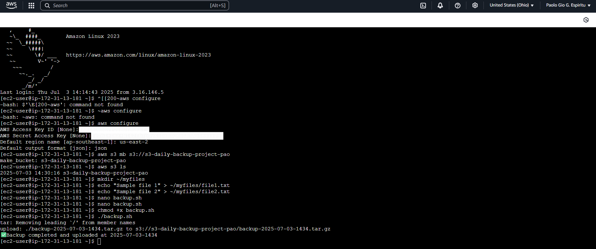

# ✅ Step 3: Install AWS CLI and Configure

## 1️⃣ Install AWS CLI on Amazon Linux 2023

Run the following command in your terminal or EC2 Instance Connect session:

```bash
sudo yum install -y awscli
```

---

##2️⃣ Configure AWS CLI

Run the following command:

```bash
aws configure
```

You’ll be prompted to enter the following (Check the IAM Credentials: Access & Secret Key, Region and Output Format):
- AWS Access Key ID
- AWS Secret Access Key
- Default region name (e.g., `ap-southeast-1` for Singapore)
- Default output format (e.g., `json`)

> 📌 These credentials should belong to an IAM user with programmatic access enabled and S3 permissions (such as `AmazonS3FullAccess` or a custom policy that allows necessary S3 actions).

---

## 📸 Output Screenshot

### ✅ Successfully Created IAM with S3 Bucket Access

Below is a screenshot confirming the IAM user creation with appropriate S3 bucket permissions:



*This screenshot confirms the successful installation and configuration of the AWS CLI on an EC2 instance. It also shows that the IAM user has been granted S3 access (e.g., via the `AmazonS3FullAccess` policy), and the `backup.sh` script is ready for automated daily backups using cron.*


