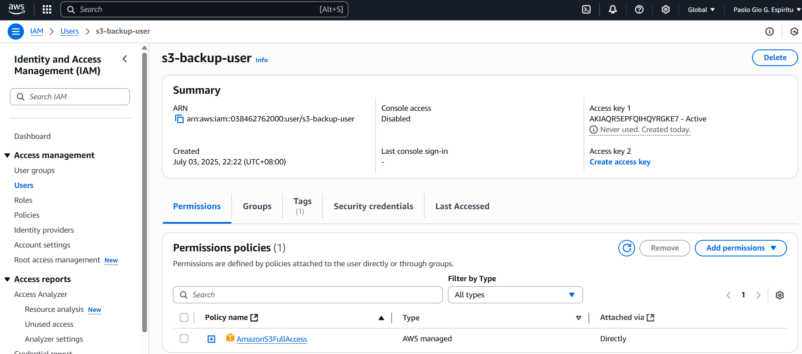

# ✅ Step 2: Creating IAM for S3 Bucket Access

## 🔐 Step 1: Go to IAM in AWS Console
1. Sign in to the AWS Management Console.
2. Navigate to IAM (Identity and Access Management).
   - You can search for “IAM” in the search bar at the top.

---

## 👤 Step 2: Create a New User
1. In the left sidebar, click Users.
2. Click the “Create users” button.
3. Enter a user name (e.g., s3-backup-user).
4. Under Select AWS access type, check:
   - ✅ Programmatic access (for CLI/API access).
  
---

## 🔐 Step 3: Set Permissions
1. Choose Attach policies directly.
2. Search and select:
   - ✅ AmazonS3FullAccess
   - (Optional: If you want restricted access, you can create a custom policy scoped to a specific bucket.)
3. Click Next.

---

## 📋 Step 4: Tags (Optional)
1. Add key-value pairs for tracking if needed (e.g., `Project:Backup`).
2. Click Next.

---

## ✅ Step 5: Review and Create
1. Double-check the user settings and permissions.
2. Click Create user.

---

## 🔑 Step 6: Save Access Credentials
1. After creation, download the .csv file or copy:
  - Access Key ID
2. Secret Access Key (you'll only see this once!)
3. Store them securely (e.g., password manager or encrypted note).

---

## ⚠️ Best Practices
- Rotate keys regularly.
- Avoid using root credentials.
- Use least privilege principle — limit permissions if full access isn’t needed.

## 📸 Output Screenshot

### ✅ Successfully Created IAM with S3 Bucket Access

Below is a screenshot confirming the IAM user creation with appropriate S3 bucket permissions:

*This confirms that an IAM user was successfully created and granted access to a specific S3 bucket. The attached policy allows actions such as listing, uploading, and downloading objects from the bucket, ensuring secure and controlled access to cloud storage.*
