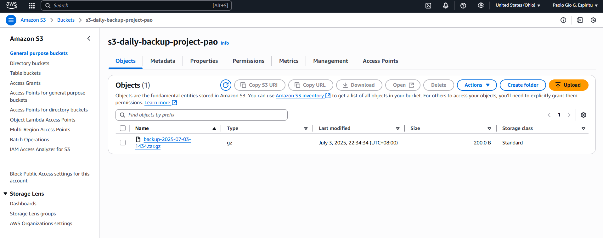

# ✅ Step 4: Create an S3 Bucket (Free Tier Eligible)

Amazon S3 provides **5 GB of standard storage for free** each month under the AWS Free Tier.

### 🛠️ To create your S3 bucket:

```bash
aws s3 mb s3://your-unique-bucket-name
```

---

> 🔸 Important
- Replace `your-unique-bucket-name` with a globally unique, all lowercase name.
- Example: `james-daily-backup-2025`

### ✅ S3 Bucket Naming Rules:
- Must be all lowercase
- No spaces
- Must be globally unique across all AWS accounts
- Avoid special characters (only . and - are allowed)

---

### ✅ Verify the Created Bucket

You can verify the bucket was created by listing all buckets:
```bash
aws s3 ls
```

---

# ✅ Step 5: Create a Folder to Back Up
Now, simulate a directory and some sample files for backup:

```bash
mkdir ~/myfiles
echo "Sample file 1" > ~/myfiles/file1.txt
echo "Sample file 2" > ~/myfiles/file2.txt
```
> This simulates real files you want to back up to your S3 bucket.

---

# ✅ Step 5: Write the Backup Script
Now, create a backup script called `backup.sh`:

```bash
nano backup.sh
```

Paste the following code:

```bash
#!/bin/bash

TIMESTAMP=$(date +%F-%H%M)
BACKUP_FILE="backup-$TIMESTAMP.tar.gz"
SOURCE_DIR=~/myfiles

# Create compressed archive
tar -czf $BACKUP_FILE $SOURCE_DIR

# Upload to S3 bucket
aws s3 cp $BACKUP_FILE s3://your-unique-bucket-name/

# Remove local backup to save space
rm $BACKUP_FILE

echo "✅ Backup completed and uploaded at $TIMESTAMP"
```

> 🔸 Note: Replace `your-unique-bucket-name` with the exact bucket name you created in Step 4.

To save and exit in `nano`, press:

```mathematica
To save and exit in nano, press:
```

---

## 📌 What's Happening in the Script:
- Compresses the folder ~/myfiles into a .tar.gz archive.
- Uploads the archive to your specified S3 bucket.
- Deletes the local archive after upload.
- Displays a success message with a timestamp.

---

# ✅ Step 6: Make the Script Executable & Test the Backup

## 🔧 1. Make `backup.sh` Executable

Before running the script, give it execute permission:

```bash
chmod +x backup.sh
```

## 🚀 2. Run the Backup Script
Now run the script:

```bash
./backup.sh
```

You should see output like:

```yaml
✅ Backup completed and uploaded at 2025-07-03-2215
```

## 🔍 3. Verify the Backup on S3
1. Go to the AWS S3 Console.
2. Open your bucket (e.g., `james-backup-lab-2025`).
3. You should see a .tar.gz file with a timestamp, like: `backup-2025-07-03-2215.tar.gz`
> ✅ This confirms that your local files were compressed and successfully uploaded to S3!
> 🧼 Optional: Check your local directory to confirm that the .tar.gz file was removed after upload.

--- 

---

# ✅ Step 7: Automate with Cron (Optional)

To automate daily backups at **1:00 AM**, use `cron`.

## 🕒 1. Edit Your Crontab

Run:

```bash
crontab -e
```

> This opens your crontab file for editing.

## 🧾 2. Add the Following Line

```bash
0 1 * * * /home/ec2-user/backup.sh >> /home/ec2-user/backup.log 2>&1
```
This cron expression means:
- `0` → Minute 0
- `1` → Hour 1 (1 AM)
- `* * *` → Every day, every month, every day of the week

✅ The script will:
- Run daily at 1:00 AM
- Append output (including errors) to `/home/ec2-user/backup.log`

> 📌 Tip: Ensure `backup.sh` is still executable and the full path is correct.
Use which `bash` or `pwd` if needed to confirm file locations.

---

## 📸 Output Screenshot

### 1. Successfully Created S3 Bucket with `backup.sh` Script Ready for Automation

Below is a screenshot of the AWS CLI configuration used to create the S3 bucket and set up the backup script:


*This screenshot confirms the successful installation and configuration of the AWS CLI on an EC2 instance. It also shows that the IAM user has been granted S3 access (e.g., via the `AmazonS3FullAccess` policy), and the `backup.sh` script is in place and ready for automated daily backups using cron.*

---

### 📸 2. Successfully Verified S3 Daily Backup Configuration

Below is a screenshot of the S3 bucket showing the uploaded backup file generated by the automation script:



*This confirms that the `backup.sh` script ran successfully and uploaded the compressed `.tar.gz` file to the designated S3 bucket as scheduled by the cron job.*
