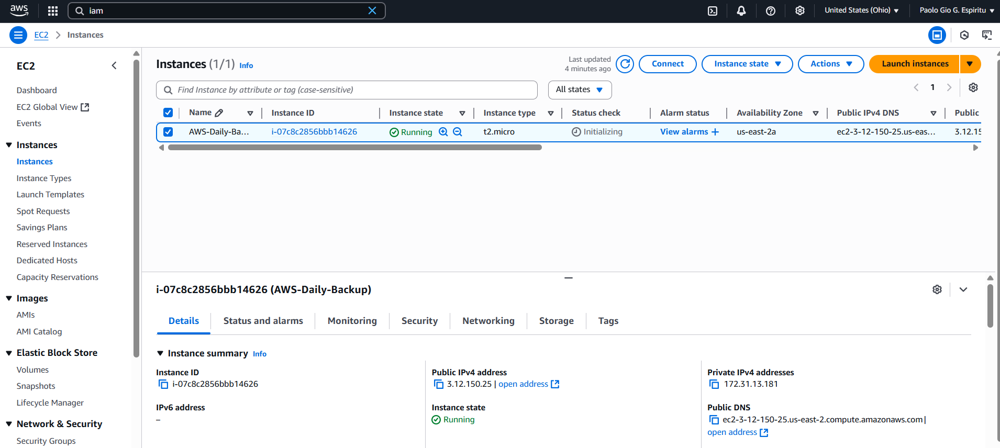
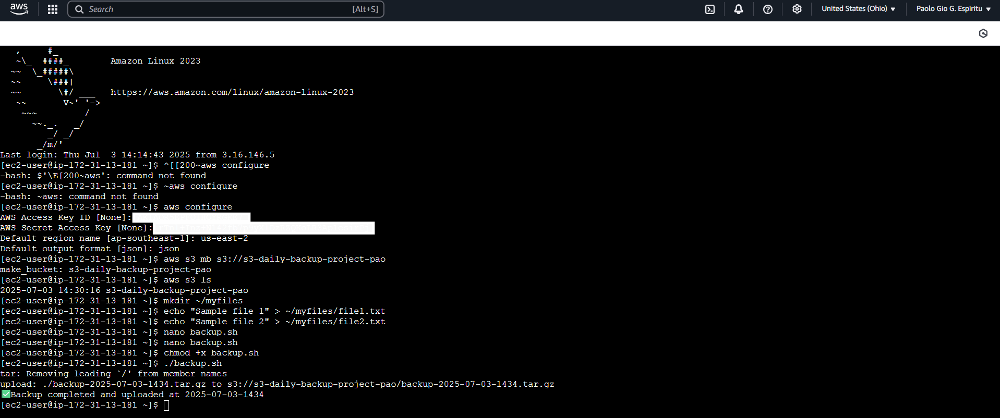

# 🛡️ AWS Daily Backup Automation using EC2, S3, and CLI

This repository contains a step-by-step guide to setting up **automated daily backups** from an EC2 instance to an Amazon S3 bucket using the AWS CLI and a scheduled cron job.

📁 **Repository Link**: [github.com/pgEspiritu/S3-Daily-Backup-Demo](https://github.com/pgEspiritu/S3-Daily-Backup-Demo)  

---

## ✅ Project Overview

This project walks through the following:

### 1️⃣ [EC2 Instance Launch (Free Tier)](EC2-Launching-For-S3-Daily-Backup.md)

- Created a **t2.micro** EC2 instance using Amazon Linux 2023.
- Configured access securely via EC2 Instance Connect.
- Ensured Free Tier compliance with correct storage and networking settings.

### 2️⃣ [IAM User Creation with S3 Permissions](Creating-IAM-for-S3.md)

- Created an **IAM user** with **programmatic access**.
- Attached **AmazonS3FullAccess** permission policy.
- Stored **Access Key ID** and **Secret Access Key** securely.

### 3️⃣ [AWS CLI Installation & Configuration](CLI-Configuration.md)

- Installed the **AWS CLI v2** on the EC2 instance.
- Configured AWS CLI using IAM credentials and default region.

### 4️⃣ [S3 Bucket Setup and Daily Backup Script](Creating-S3-With-Daily-Backup-Config.md)

- Created an S3 bucket with a globally unique name.
- Developed a `backup.sh` script to:
  - Compress local files
  - Upload to S3
  - Clean up local storage
- Scheduled the script with **cron** to run daily at 1 AM.

---

## 🧠 Lessons & Knowledge Gained

- Understanding of **cloud resource provisioning** (EC2, S3, IAM).
- Hands-on experience with **AWS CLI installation and setup**.
- Learned how to:
  - Create automated solutions using **bash scripting**
  - Schedule tasks using **cron jobs**
  - Securely manage and use **IAM credentials**
- Gained awareness of **AWS Free Tier limits and resource management**

---

## 💡 Skills Demonstrated

- 🔁 **Problem Solving**: Implemented an automated solution for recurring backups.
- ⚙️ **Automation**: Used cron and bash scripting to streamline daily backup tasks.
- 🔐 **Security Best Practices**: Created least-privilege IAM roles with scoped permissions.
- ☁️ **Cloud Operations**: Demonstrated cross-service interaction between EC2, S3, and IAM.

---

## 📸 Screenshots

- ✅ EC2 Launching for S3 Daily Backup Automation Configuration
  
- ✅ IAM Configuration for S3 Bucket Access
  
- ✅ AWS CLI Installation and Configuration
  
- ✅ S3 Bucket with Backup File (Automated)
  

---

## 📌 Summary

This project serves as a practical foundation in **AWS automation and cloud resource management**, showcasing the ability to proactively manage data backups and infrastructure operations using native AWS services like EC2, S3, IAM, and the AWS CLI.

---

## 🏅 Credits

Special thanks to **Sir James Santos** and **Master Cloud Training** for the inspiration and foundational lessons in this guide.  
This walkthrough is a personalized adaptation based on concepts taught in his eBook: 📘 *Build your First Cloud Portfolio*

